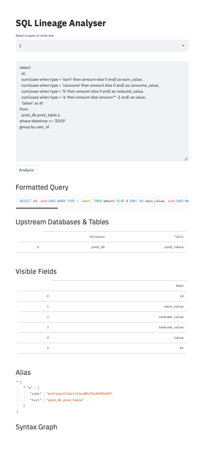

# sql lineage analyser

The repository provides an api service for analysing the lineage of SQL queryies.

streamlit demo ↓



## demo

#### install
```
pip install -r requirements.txt
```

#### run streamlit demo
For debug and dev only.

```
streamlit run streamlit.py
```

## api

#### run local
```
WHITELIST="127.0.0.1" python app.py
```

#### run test
```
python -m unittest test/PrestoSQL.py
```

#### build docker
```
bash build.sh
```

#### run docker
```
docker container stop sql-lineage-analyser && docker container rm sql-lineage-analyser
docker run -d --name sql-lineage-analyser -e WHITELIST="127.0.0.1,0.0.0.0" -p 5100:5000 sql-lineage-analyser:latest python app.py

```

## doc

#### deploy swagger api

Before deployment, download repo to /data/sql-lineage-analyser and
update servers url in openapi.yaml .

```
docker run -d --name sql-lineage-analyser-doc -e SWAGGER_JSON=/yaml/openapi.yaml -v /Users/zhiyang.wang/data/sql-lineage-analyser:/yaml -p 5101:8080 swaggerapi/swagger-ui
```
